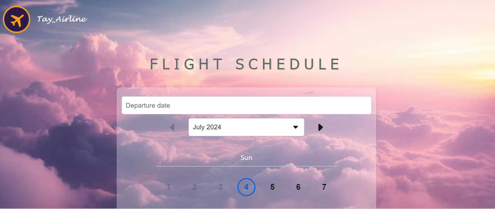

# Getting Started with Create React App

This project was bootstrapped with [Create React App](https://github.com/facebook/create-react-app).

## Available Scripts

In the project directory, you can run:  
npx create-react-app my-app  
cd my-app  
npm start  

# Interface-only  
**required: { node: '^18.16.0', npm: '>=9.5.1' }  
"dependencies": {
    "@skyscanner/backpack-web": "34.4.0",
    "@testing-library/jest-dom": "^5.14.1",
    "@testing-library/react": "^13.0.0",
    "@testing-library/user-event": "^13.2.1",
    "react": "^18.3.1",
    "react-dom": "^18.3.1",
    "react-scripts": "5.0.1",
    "react-transition-group": "^4.4.5",
    "web-vitals": "^2.1.0"
  },  

Result:  

